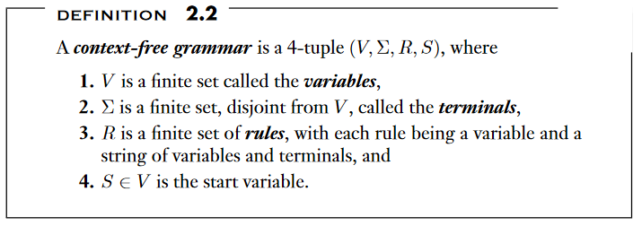
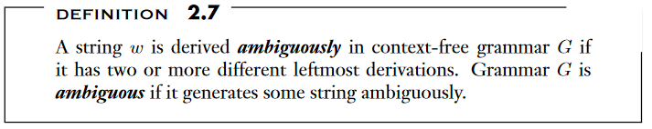
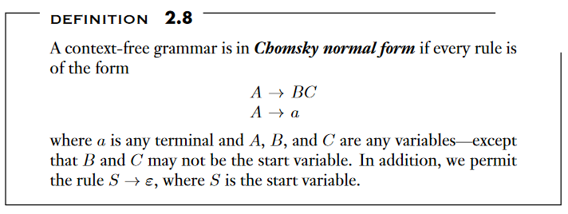
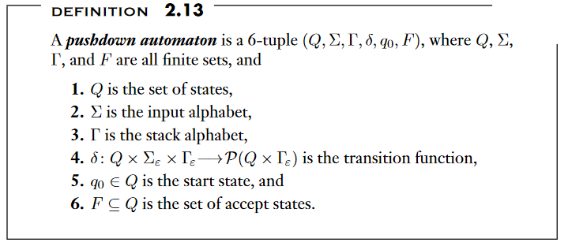
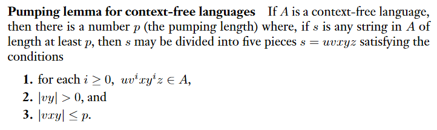
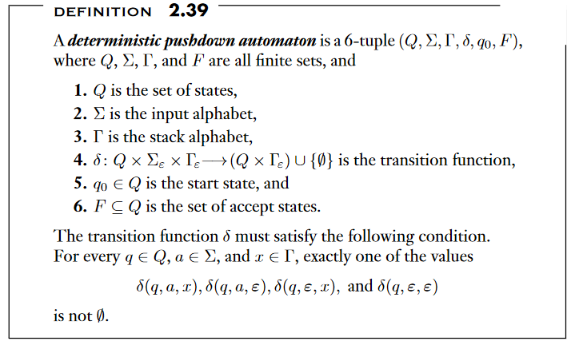
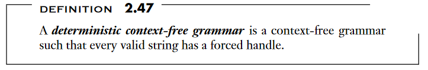

# Chapter 2: Context Free Grammars

## 2.1: Context-Free Grammars

Context-free grammars
: A grammar based way to determin a language

Pushdown automata
: Class of machines recognizing context-free languages

Substitution rules (aka Productions)
: collection of rules that make up a CFG

Terminals
: consists of variables and other symbols

Start Variable
: The variable that starts off the grammar

Derivation
: Sequence of substitutions to obtain a certain string

Parse Tree
: A pictoral representation of derivation

### Formal Definition of a Context-Free Grammar

---

Language of the grammar
: Set of all strings that exist within the language

Context-Free Language
: Any language that can be generated by some context-free grammar

### Designing Context-Free Grammars

---

### Ambiguity

---

### Chomsky Normal Form

---

`Theorem 2.9
: Any context free language is generated by a context-free grammar in Chompsky Normal Form

## 2.2 Pushdown Automata

---

Pushdown Automata
: Nondeterministic finite automata, but have a stack component

### Formal Definition of a Pushdown Automaton

---

### Equivalence with Context-Free Grammars

---

Theorem 2.20
: A language is context free if and only if some pushdown automaton recognizes it

Lemma 2.21
: If a language is context free, then some pushdown automaton recognizes it

Lemma 2.27
: If a pushdown autamaton recognizes some language, then it is context free

Corollary
: Every regular language is context free

## 2.3 Non-context-free Languages

---

Pumping Length
: A value such that all longer strings in the language can be pumped

Pumping Lemma for context-free languages

### Pumping Lemma for CFLS

---

## 2.4 Deterministic Context-Free Languages

---

epsilon-input moves
: A type of epsilon input move for regular DFAs?

epsilon-stack moves
: epilson move corresponding to the stack

Lemma 2.41
: Every DPDA has an equivalent DPDA that always reads the entire input string

### Properties of DCFLs

Theorem 2.42
: The class of DCFLs is closed under complementation

Endmarked inputs
: a special endmarker symbol is appended to the input string to mark the end

Endmarked language
: collection of strings that have the endmarked symbol

Theorem 2.43
: A is a DCFL is and only if endmarked symbol is DCFL

### Deterministic Context-Free Grammars

Reduced Step
: a reversed substitution, where the terminals on the RHS is replaced by the variable on the LHS

Reducing String
: the original string replaced by the reducint step

Reduction
: a reverse derivation via reduced steps

Authors Note: I decided to not go further down this reduction path because it hasn't been covered during lecture and will begin reading now.

## Learning how to read a textbook more effectively

[] Pre-read

- Read Captions & Illustrations
- Write down Equations in Boxes

[] Chapter Summaries
[] Take notes

- Phrase and create questions for you

[] Review
