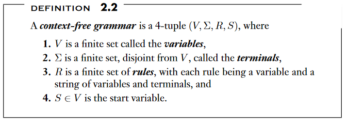
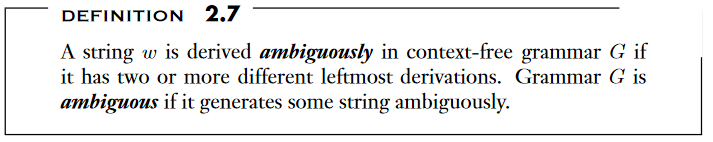
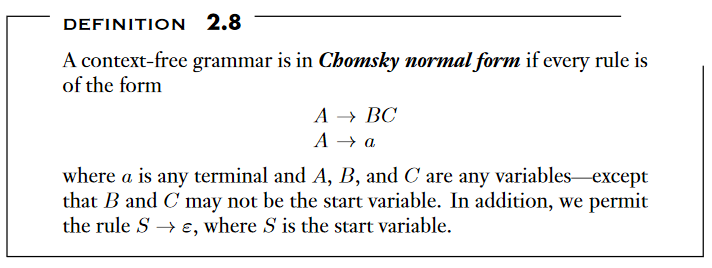
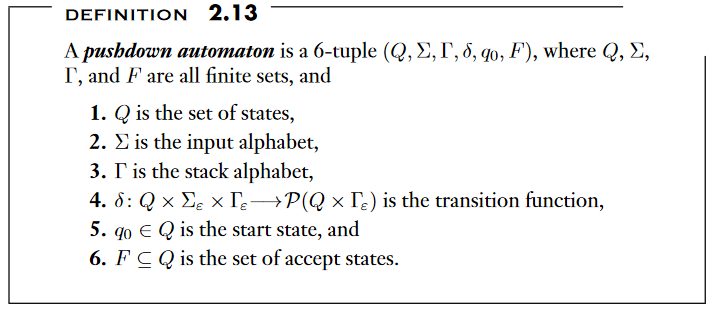
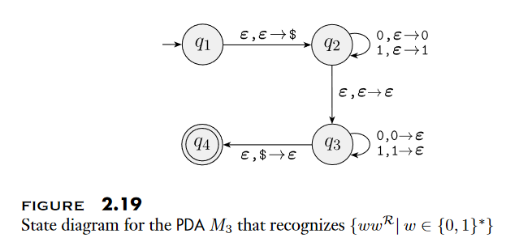
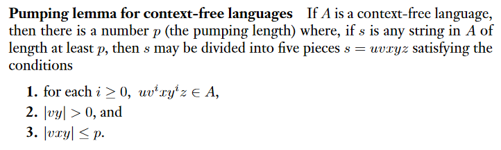
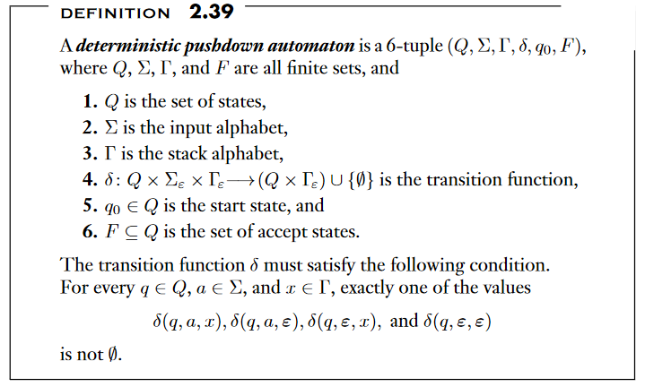
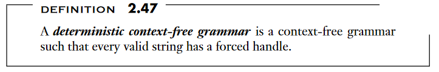

# Chapter 2: Context Free Grammars

Context-free grammars
: A grammar based way to determin a language

Pushdown automata
: Class of machines recognizing context-free languages

## 2.1: Context-Free Grammars

---

Substitution rules (aka Productions)
: collection of rules that make up a CFG

Terminals
: consists of variables and other symbols

Start Variable
: The variable that starts off the grammar

Derivation
: Sequence of substitutions to obtain a certain string

Parse Tree
: A pictoral representation of derivation

### Formal Definition of a Context-Free Grammar

---

Language of the grammar
: Set of all strings that exist within the language. Sometimes denoted as L(G).

Context-Free Language
: Any language that can be generated by some context-free grammar

Yields
: A one step derivation $$ uAu \rightarrow uwu $$

Derives
: When you can get from a to b with a sequence of rules

### Designing Context-Free Grammars

---

(1) Break up CFGs into simpler parts
(2) If you want equal numbers try R -> uRv
(3) Find recursive substructionand place variables there

Also does teach how to change any DFA into a CFG.

### Ambiguity

---

A grammar may generate the same string in multiple different ways, with different parse trees and meanings.

Inherently Ambiguous
: Languages that can only be defined by ambiguous grammars

### Chomsky Normal Form

---

Theorem 2.9
: Any context free language is generated by a context-free grammar in Chompsky Normal Form

Notes on Proof 2.9

#### Algorithm to turn any CFG into CNF

1. Create a new start variable S
2. Then eliminate all the epsilon-rules of the form $$ A \rightarrow \epsilon $$
3. Eliminate all unit rules $$ A \rightarrow B $$
4. Convert other rules to adhere to the changes

(2) For example $ R \rightarrow uAvAw $ and $ A \rightarrow \epsilon$ we need to create the rules $ R \rightarrow uAvw $ and $ R \rightarrow uvAw $ and $ R \rightarrow uvw $.
(3) Use transitivity to get rid of any unit rules
(4) Split up the longer rules into 2-variable form

## 2.2 Pushdown Automata

---

Pushdown Automata
: Nondeterministic finite automata, but have a stack component

Pushdown automata are equivalent to CFGs.

The benefit of a stack is that it has unlimited amount of information. A PDA can recognize string that an DFA cannot because of the limitless storage.

Pushdown automatas may be nondeterministic. Nondeterministic and deterministic pushdown automata are not equivalent in power.

### Formal Definition of a Pushdown Automaton

---

The machine may use different alphabets for its input and its stack, so there are two alphabets. $\Sigma$ which represents the input alphabet, $\Gamma$ which represents the stack-alphabet.

Domain of all possible transitions is $Q \times \Sigma \times \Gamma$.

Three things are needed to transition, (1) the current state (2) next input symbol to be read (3) a top symbol of the stack.

If the symbol happens to be $\epsilon$ then the machine will move without reading a symbol from the input, or read a symbol from the stack.

The transition function will return a "set" within the PowerSet of all possible reachable states.

PDA accepts $w$ if $w = w_{1}w_{2} \dots w_{n}$ where each w exists in the input language. And there exists a sequence of states and strings that fufill three conditions.

(1) The state must start at $q_{0}$ and $s_{0}$ (the state of the stack) must be empty.
(2) Every move we make moves according to the state, stack and input symbol.
(3) There exists an accept state at the end.

#### Example 2.18

$$ \{ ww^{R} | w \in \{0, 1\}^* \}. $$

Creating a PDA that accepts the string and then the string reversed.

This automata works because since we're allowing a non-deterministic push down automata, we keep inserting 0s if we see a 0, and 1s if we see a 1. And nondeterministically choose a point to pop-off 0s and 1s to the stack.

If the stack returns empty, then it must preserve the order, and have had exactly that many numbers of 0s and 1s.

### Equivalence with Context-Free Grammars

---

Theorem 2.20
: A language is context free if and only if some pushdown automaton recognizes it

Lemma 2.21
: If a language is context free, then some pushdown automaton recognizes it

#### Proof Notes

* PDA P will accept w (if it's in the language)
* G accepts w if there is a derivation
* Derivations are made by substitutions in the grammar

Each step of the derivation there is a intermediate string between them.

Problem: We don't really know which substitution we need to make at every step.
Solution: Use the stack to test all possibillities

* P writes the start variable onto the stack.
* Then it goes through the intermediate strings and substitutes
* Then P will terminate
* P accepts the string when we reach the ending terminal

Problem: But in order to this, we need P to store the intermediate strings.
Solution: Keep a part of the intermediate string on the stack (the first part of the letter)

(1) If the top of the stack is a variable symbol, nondeterminisitcally select one of the rules for A and substitute A by the string on the RHS.
(2) If the top of the stack is a terminal symbol, read the next symbol from the input and compare it to a.
(2a) If they match, repeat, if they don't match reject
(3) If the top of the stack is $ then accept it.

We're kind of non-deterministically unwrapping the CFG into a PDA. Kind of like what we did for NFAs and DFAs. 

Lemma 2.27
: If a pushdown autamaton recognizes some language, then it is context free

Corollary
: Every regular language is context free

## 2.3 Non-context-free Languages

---

Pumping Length
: A value such that all longer strings in the language can be pumped

Pumping Lemma for context-free languages

### Pumping Lemma for CFLS

---

#### Proof Intution

## 2.4 Deterministic Context-Free Languages

---

epsilon-input moves
: A type of epsilon input move for regular DFAs?

epsilon-stack moves
: epilson move corresponding to the stack

Lemma 2.41
: Every DPDA has an equivalent DPDA that always reads the entire input string

### Properties of DCFLs

Theorem 2.42
: The class of DCFLs is closed under complementation

Endmarked inputs
: a special endmarker symbol is appended to the input string to mark the end

Endmarked language
: collection of strings that have the endmarked symbol

Theorem 2.43
: A is a DCFL is and only if endmarked symbol is DCFL

### Deterministic Context-Free Grammars

Reduced Step
: a reversed substitution, where the terminals on the RHS is replaced by the variable on the LHS

Reducing String
: the original string replaced by the reducint step

Reduction
: a reverse derivation via reduced steps

Authors Note: I decided to not go further down this reduction path because it hasn't been covered during lecture and will begin reading now.

## Learning how to read a textbook more effectively

[] Pre-read

- Read Captions & Illustrations
- Write down Equations in Boxes

[] Chapter Summaries
[] Take notes

- Phrase and create questions for you

[] Review
